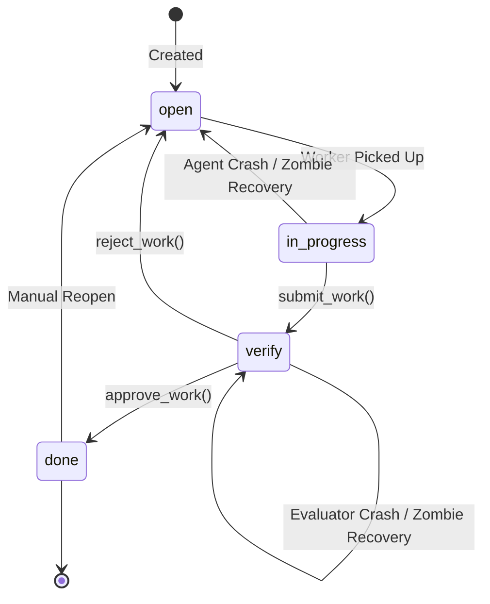

# Citadel Finite State Machine (FSM)

This document describes the lifecycle of a **Bead** (task) within The Citadel, detailing the states, transitions, and the actors (Conductor, Router, Worker, Gatekeeper) responsible for moving beads through the system.

## Bead States

A Bead can exist in one of four primary statuses:

| Status            | Description                                                                                         |
| :---------------- | :-------------------------------------------------------------------------------------------------- |
| **`open`**        | The task is defined and ready for execution (provided dependencies are met).                        |
| **`in_progress`** | A **Worker Agent** has actively claimed the task and is executing it.                               |
| **`verify`**      | The Worker has submitted the work. It is now waiting for a **Gatekeeper** (Evaluator) to review it. |
| **`done`**        | The task has been successfully completed and verified.                                              |

## State Validation & Persistence Guard

Transitions between states are guarded by strict rules and a persistence layer that ensures data integrity:

1.  **Strict Transitions**: Beads can only move between states defined in the FSM (e.g., `verify -> open` is allowed; `open -> done` is blocked).
2.  **Completion Requirement**: To transition to `done`, a bead normally requires an `acceptance_test` property.
    *   *Exception*: If the bead has the `failed` label (Terminal Failure), this requirement is bypassed.
3.  **Persistence Guard (v0.1.23)**: The `WorkQueue` enforces idempotency for task completion. Once an agent tool (like `submit_work`) marks a ticket as `completed`, any subsequent automated Hook cleanup attempts are ignored. This prevents final "narration strings" from overwriting structured tool output.

---

## Lifecycle: The Worker

The **Worker** is responsible for transforming an `open` bead into a `verify` bead.

```mermaid
sequenceDiagram
    participant C as Conductor
    participant Q as WorkQueue
    participant W as Worker Hook
    participant A as Worker Agent
    participant B as Beads DB

    Note over C: Cycle: Router
    C->>B: ready() (status=open & blockers=done)
    B-->>C: [Bead A]
    C->>Q: Enqueue Ticket (Bead A)

    Note over C: Cycle: Scale Pools
    C->>Q: Claim Ticket
    Q-->>W: Ticket (Bead A)
    
    rect rgb(20, 20, 40)
        Note right of W: Worker Hook Start
        W->>B: Update status -> 'in_progress'
        
        W->>A: run(Bead A)
        
        alt Agent Success
            A->>A: Tools (filesystem, etc.)
            A->>B: Tool: submit_work() -> status='verify'
            A-->>W: Success
        else Agent Failure / Zombie
            A-->>W: Exits without submit_work
        end
        
        Note right of W: Post-Run Check (Zombie Prevention)
        W->>B: get(Bead A)
        B-->>W: Current Status
        
        alt Status is 'in_progress' (Zombie)
            W->>B: Update status -> 'open' <br/> labels=['agent-incomplete']
        end
    end
```

### Critical Transitions

1.  **Pickup**: When the Conductor's Worker Hook claims a ticket, it immediately sets `status = 'in_progress'`.
2.  **Success**: The `WorkerAgent` MUST call the `submit_work` tool. This tool updates `status = 'verify'`.
3.  **Zombie Prevention**: If the `WorkerAgent` exits (crashes, timeouts, or LLM refuses to tool-call) *without* transitioning the bead, the Worker Hook detects this state mismatch. It explicitly rolls the bead back to `status = 'open'` (adding an `agent-incomplete` label) so it can be retried.

---

## Lifecycle: The Gatekeeper

The **Gatekeeper** is responsible for verifying work, effectively functioning as a QA agent.

```mermaid
sequenceDiagram
    participant C as Conductor
    participant Q as WorkQueue
    participant G as Gatekeeper Hook
    participant E as Evaluator Agent
    participant B as Beads DB

    Note over C: Cycle: Router
    C->>B: list('verify')
    B-->>C: [Bead A]
    C->>Q: Enqueue Ticket (Bead A)

    Note over C: Cycle: Scale Pools
    C->>Q: Claim Ticket
    Q-->>G: Ticket (Bead A)
    
    rect rgb(20, 40, 20)
        Note right of G: Gatekeeper Hook Start
        
        G->>E: run(Bead A)
        
        alt Validation Pass
            E->>B: Tool: approve_work() -> status='done'
        else Validation Fail
            E->>B: Tool: reject_work() -> status='open'
        else Agent Failure
            E-->>G: Exits without decision
        end
        
        Note right of G: Post-Run Check
        G->>B: get(Bead A)
        
        alt Status is 'verify' (Zombie)
            G->>B: Update status -> 'verify' <br/> labels=['evaluator-incomplete']
            Note right of G: Remain in 'verify' for re-evaluation
        end
    end
```

### Critical Transitions

1.  **Pickup**: The Gatekeeper picks up beads in `verify` status.
2.  **Approval**: If the **EvaluatorAgent** calls `approve_work`, the bead becomes `done`.
3.  **Rejection**: If the **EvaluatorAgent** calls `reject_work`, the bead becomes `open` (with a `rejected` label). This allows the Router to immediately re-queue the work for a new Worker attempt.
4.  **Zombie Prevention**: If the agent exits without decision, the Hook detects that the status is still `verify`. It adds an `evaluator-incomplete` label but keeps the status as `verify` so it is immediately eligible for re-evaluation by another Gatekeeper.

---

## Failure Modes & Recovery

| Failure Scenario           | Detected By                                | Action Taken     | Resulting State                   |
| :------------------------- | :----------------------------------------- | :--------------- | :-------------------------------- |
| **Worker Crash**           | Conductor Worker Hook (try/catch)          | Mark as failed   | `open` + `failed`, `agent-error`  |
| **Worker No-Op**           | Conductor Worker Hook (post-run logic)     | Rollback to open | `open` + `agent-incomplete`       |
| **Gatekeeper Crash**       | Conductor Gatekeeper Hook (try/catch)      | Log error        | `verify` + `evaluator-error`      |
| **Gatekeeper No-Op**       | Conductor Gatekeeper Hook (post-run logic) | Flag for retry   | `verify` + `evaluator-incomplete` |
| **Stuck in `in_progress`** | Router (stuck bead recovery)               | Reset to open    | `open` + `auto-recovered`         |
| **Gatekeeper Rejection**   | EvaluatorAgent (`reject_work`)             | Reset to open    | `open` + `rejected`               |

This robust state machine ensures that **no task is ever left behind** (Zombified), regardless of LLM stability or runtime errors.

---

## Technical Observations & Edge Cases

While the FSM provides strong resilience, the following edge cases and architectural choices should be noted:

### 1. Implicit Sub-States (Labels)
Citadel uses labels as semantic modifiers to the 4 primary states. This creates "sub-states" that the Conductor logic must check:
- **`open` + `failed`**: A task that encountered a critical error and is pending manual intervention or a specific retry strategy.
- **`open` + `agent-incomplete`**: A task that was attempted but where the agent exited prematurely.
- **`open` + `recovery`**: A conditional task that the Router will either skip (if the blocker succeeds) or allow to run (if the blocker fails).
- **`open` + `rejected`**: A task that was rejected by the Gatekeeper and is pending rework by a Worker.
- **`open` + `auto-recovered`**: A task that was stuck in `in_progress` with no active ticket and was automatically reset by the Router.

### 2. Race Condition Mitigation
The transition from `open` to `in_progress` is technically a race condition.
- **The Gap**: The Router fetches a bead as `open` and enqueues it. Between enqueuing and the Worker Hook claiming the ticket, the bead status could change.
- **The Fix**: The Conductor implements a **Double-Check** inside the Worker Hook. Before invoking the agent, it re-fetches the bead from the database. If the status is no longer `open`, the hook exits without processing.

### 3. Verification Retry Loops
When a Gatekeeper fails (e.g., `evaluator-incomplete`), the bead remains in `verify`.
- **The Behavior**: It becomes immediately eligible for re-routing.
- **The Risk**: If the verification failure is systematic (e.g., environmental issues or bad test definitions), this can lead to a **tight retry loop** where evaluate agents are repeatedly invoked against the same failing task.
- **Future Improvement**: Implementing an exponential backoff or max-retry counter for the `verify` state.

### 4. Recovery Bead Shortcut
Recovery beads follow a "Short-Circuit" path:
- If `blocker.status === 'done'` and no `failed` label is present, the Router automatically transitions the recovery bead to `done` without ever enqueuing it.
- This effectively bypasses the sequence diagrams for common success paths.

### 5. Timeout & Stall Detection
The `WorkQueue` tracks ticket heartbeats.
- If a Worker or Gatekeeper process crashes without the Hook finishing (e.g. SIGKILL of the Conductor), the ticket remains `claimed`.
- The `release_stalled` mechanism monitors heartbeats and eventually returns these tickets to `pending`.
- The FSM handles "Agent Level" failures via the `try/catch` in the hooks, while the Queue handles "Process Level" failures via heartbeats.
