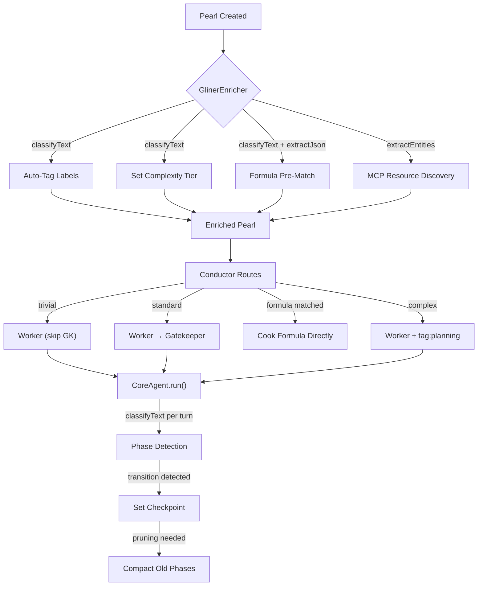

# GLiNER2 Integration Opportunities

> **GLiNER2** is a 205M-parameter model for multi-task information extraction: NER, classification, and structured data extraction — running locally on CPU with zero external dependencies.

This document explores how The Citadel can leverage GLiNER2 as a **fast, local perception layer** that sits _before_ expensive LLM reasoning. The core thesis: **use a tiny model to _see_ what's in the text, so the big model can _think_ about what to do with it.**

```
Pearl Created → GLiNER2 (extract, classify, enrich) → Enriched Pearl → Agent (reason, execute)
```

## The `gliner2-mcp` Server

We have a production-ready MCP server ([gliner2-mcp](../docs/gliner2-mcp.README.md)) that wraps GLiNER2 as a standard MCP tool provider. It exposes **three tools**:

| MCP Tool          | Signature        | Returns                                                             |
| :---------------- | :--------------- | :------------------------------------------------------------------ |
| `extractEntities` | `(text, labels)` | `{ label: string[] }` — entity spans grouped by label               |
| `classifyText`    | `(text, schema)` | `{ field: string \| string[] }` — single/multi-label classification |
| `extractJson`     | `(text, schema)` | Structured JSON matching the provided schema                        |

### Citadel Configuration

```typescript
// citadel.config.ts
mcpServers: {
    gliner: {
        command: "uv",
        args: ["run", "gliner2-mcp"],
        env: {
            GLINER2_MODEL_ID: "fastino/gliner2-base-v1",
            // GLINER2_DEVICE: "cpu",  // optional
        }
    }
}
```

The server connects via **stdio transport** — the same mechanism Citadel already uses for filesystem and other MCP servers. No new protocol, no HTTP, just another entry in `mcpServers`.

---

## 1. Automatic Tag Discovery (Replace Manual Labeling)

**Current state:** Tags like `tag:git`, `tag:planning` are manually applied to Pearls. The `TagProvider` then loads matching instruction files (`.citadel/instructions/tag-git.md`).

**Opportunity:** When a Pearl is routed, call `gliner_classifyText` on its title + description to detect relevant domains. Automatically apply matching `tag:*` labels _before_ the Worker starts.

### Implementation

Add a `GlinerEnricher` class in `src/core/gliner-enricher.ts` that the Conductor calls during `cycleRouter`:

```typescript
// src/core/gliner-enricher.ts
import { getMCPService } from "../services/mcp";
import { getPearls, type Pearl } from "./pearls";
import { logger } from "./logger";

export class GlinerEnricher {
    // Scan .citadel/instructions/ for tag-*.md files to build the label registry
    private tagRegistry: string[] = []; // e.g. ["git", "database", "auth", "testing", "planning"]

    async enrichTags(pearl: Pearl): Promise<string[]> {
        const mcp = getMCPService();
        const text = `${pearl.title} ${pearl.description || ""}`;

        const result = await mcp.callTool("gliner", "classifyText", {
            text,
            schema: {
                domain: {
                    labels: this.tagRegistry,
                    multi_label: true,
                    cls_threshold: 0.5
                }
            }
        }) as { domain: string[] };

        // Returns matched tags, e.g. ["git", "auth"]
        return (result.domain || []).map(tag => `tag:${tag}`);
    }
}
```

The Conductor hook in `cycleRouter`, just before enqueuing the Pearl:

```typescript
// In Conductor.cycleRouter, before enqueue:
if (this.glinerEnricher) {
    const newTags = await this.glinerEnricher.enrichTags(fresh);
    if (newTags.length > 0) {
        const merged = [...new Set([...(fresh.labels || []), ...newTags])];
        await pearlsClient.update(pearl.id, { labels: merged });
        logger.info(`[Router] GLiNER2 auto-tagged ${pearl.id}: ${newTags.join(", ")}`);
    }
}
```

**Impact:** Agents receive specialized instructions without human intervention. The `TagProvider` already supports this — we just populate labels automatically. Zero changes to the instruction pipeline.

---

## 2. Smart MCP Context Retrieval (Entity-Driven Resource Discovery)

**Current state:** MCP resources are declared statically at three levels: agent config, formula TOML, or pearl context. The `MCPResourceProvider` fetches exactly what's specified — nothing more.

**Opportunity:** Use `gliner_extractEntities` to extract _semantic entities_ from a Pearl's description, then use those entities as **search queries** against MCP resource registries. This transforms MCP from "pull what's configured" to "discover what's relevant."

### Implementation

Extend `MCPResourceProvider.getInstructions()` with a discovery phase:

```typescript
// In MCPResourceProvider.getInstructions(), after static resource collection:

// --- Dynamic Discovery via GLiNER2 ---
if (ctx.pearlId) {
    const pearl = await getPearls().get(ctx.pearlId);
    const text = `${pearl.title} ${pearl.description || ""}`;

    // Step 1: Extract entities
    const entities = await mcpService.callTool("gliner", "extractEntities", {
        text,
        labels: ["module", "service", "technology", "concept", "file"]
    }) as Record<string, string[]>;

    // Step 2: List available resources from all connected MCP servers
    for (const [serverName, _] of Object.entries(resourcesToFetch)) {
        const available = await mcpService.listResources(serverName);

        // Step 3: Match extracted entities against resource names/URIs
        for (const resource of available) {
            const uri = (resource as { uri: string }).uri;
            const name = (resource as { name?: string }).name || uri;
            const allEntities = Object.values(entities).flat();

            for (const entity of allEntities) {
                if (name.toLowerCase().includes(entity.toLowerCase())) {
                    // Auto-discover this resource
                    if (!resourcesToFetch[serverName]) {
                        resourcesToFetch[serverName] = new Set();
                    }
                    resourcesToFetch[serverName].add(uri);
                }
            }
        }
    }
}
```

**Architecture:**
```
MCPResourceProvider.getInstructions()
  ├─ Static resources (existing: config → formula → pearl context)
  └─ Dynamic discovery (NEW)
       ├─ gliner.extractEntities(pearl.title + description)
       ├─ mcpService.listResources(server) for each connected server
       ├─ match(entities, resource_names)
       └─ mcpService.readResource(matched_resources)
```

> [!TIP]
> Particularly powerful with CodeFlow's memory system — entities like module names and concepts map directly to `memory://` URIs. A task mentioning "UserService" would automatically pull `memory://modules/UserService` if it exists.

---

## 3. Task Complexity Classification (Adaptive Workflow Selection)

**Current state:** All `open` pearls go through the same pipeline: Worker → Gatekeeper. There's no differentiation between "rename a variable" and "redesign the database schema."

**Opportunity:** Classify task complexity at routing time and adapt the workflow path.

### Implementation

A single `classifyText` call in `Conductor.cycleRouter`:

```typescript
// In Conductor.cycleRouter, before enqueueing:
const mcp = getMCPService();
const text = `${fresh.title} ${fresh.description || ""}`;

const result = await mcp.callTool("gliner", "classifyText", {
    text,
    schema: {
        complexity: ["trivial", "standard", "complex", "research"]
    }
}) as { complexity: string };

const complexity = result.complexity;
```

Then route based on the result:

| Complexity | Conductor Behavior                                                            |
| :--------- | :---------------------------------------------------------------------------- |
| `trivial`  | Enqueue to worker with `skip_gatekeeper` label — auto-close on `submit_work`  |
| `standard` | Normal Worker → Gatekeeper flow (current default)                             |
| `complex`  | Add `tag:planning` label — Worker receives bonding/decomposition instructions |
| `research` | Add `tag:research` label — Worker receives research-specialized prompts       |

```typescript
if (complexity === "trivial") {
    const merged = [...(fresh.labels || []), "skip_gatekeeper"];
    await pearlsClient.update(pearl.id, { labels: merged });
} else if (complexity === "complex") {
    const merged = [...(fresh.labels || []), "tag:planning"];
    await pearlsClient.update(pearl.id, { labels: merged });
}
// Then enqueue to worker as normal
```

The `skip_gatekeeper` label would be checked in the Gatekeeper hook — if present, auto-approve without LLM evaluation.

---

## 4. Structured Output Pre-Validation (Gatekeeper Fast Path)

**Current state:** The Gatekeeper uses a full LLM call to verify every submitted work item. This is expensive for outputs that clearly meet or clearly miss their acceptance criteria.

**Opportunity:** Before invoking the Gatekeeper LLM, run `gliner_extractEntities` on both the Worker's output and the Pearl's `acceptance_test`. Compare the extracted deliverables against requirements for a fast-path decision.

### Implementation

In the Gatekeeper hook in `Conductor`, before spawning the `EvaluatorAgent`:

```typescript
// In Conductor's gatekeeper pool hook:
const submittedWork = pearl.output || this.queue.getOutput(ticket.pearl_id);
const acceptanceTest = pearl.acceptance_test;

if (submittedWork && acceptanceTest) {
    const mcp = getMCPService();

    const deliverables = await mcp.callTool("gliner", "extractEntities", {
        text: typeof submittedWork === "string" ? submittedWork : JSON.stringify(submittedWork),
        labels: ["file_modified", "test_added", "feature_implemented", "bug_fixed"]
    }) as Record<string, string[]>;

    const requirements = await mcp.callTool("gliner", "extractEntities", {
        text: acceptanceTest,
        labels: ["required_file", "required_test", "required_feature", "required_fix"]
    }) as Record<string, string[]>;

    const deliverableCount = Object.values(deliverables).flat().length;
    const requirementCount = Object.values(requirements).flat().length;

    if (requirementCount > 0) {
        const coverage = deliverableCount / requirementCount;
        if (coverage >= 1.0 && !pearl.labels?.includes("force_review")) {
            // Fast-approve: all requirements appear to be met
            logger.info(`[Gatekeeper] Fast-approving ${pearl.id} (coverage: ${coverage})`);
            await pearlsClient.update(pearl.id, {
                status: "done",
                acceptance_test: `Auto-approved (GLiNER2 coverage: ${coverage.toFixed(2)}). ${acceptanceTest}`,
            });
            return; // Skip LLM evaluation
        }
    }
}
// Fall through to normal LLM-based evaluation
```

**Impact:** Reduces Gatekeeper LLM costs. Most tasks either clearly pass or clearly fail — the ambiguous middle ground is where the LLM adds real value.

---

## 5. Formula Intent Matching (Smart Pearl Preprocessing)

**Current state:** The Router is deterministic — `open` pearls go to Worker, `verify` to Gatekeeper. No LLM in the routing path. However, when a user creates a free-form Pearl (e.g., `prl create "Run the feature release for Dark Mode"`), the **Worker** must interpret the intent, identify the right formula, and extract variables — consuming expensive LLM tokens on what is essentially a classification problem.

**Opportunity:** Use `gliner_classifyText` + `gliner_extractJson` as a **pre-processing step** that matches Pearl descriptions to formulas and extracts variables _before_ the Worker even starts.

### Implementation

```typescript
// In Conductor.cycleRouter, before enqueueing open pearls:
const formulaNames = getFormulaRegistry().listNames(); // ["feature_release", "bug_fix", "deploy", ...]

if (formulaNames.length > 0) {
    const mcp = getMCPService();
    const text = `${fresh.title} ${fresh.description || ""}`;

    // Step 1: Classify against known formulas
    const match = await mcp.callTool("gliner", "classifyText", {
        text,
        schema: { formula: formulaNames }
    }) as { formula: string };

    if (match.formula) {
        const formula = getFormulaRegistry().get(match.formula);
        if (formula?.vars) {
            // Step 2: Extract variables using structured extraction
            const varSchema: Record<string, string[]> = {};
            varSchema[match.formula] = Object.entries(formula.vars).map(
                ([key, def]) => `${key}::str::${(def as { description: string }).description}`
            );

            const vars = await mcp.callTool("gliner", "extractJson", {
                text,
                schema: varSchema
            }) as Record<string, unknown>;

            // Step 3: Cook the formula automatically
            logger.info(`[Router] GLiNER2 matched formula "${match.formula}" for ${pearl.id}`);
            await cookFormula(match.formula, vars[match.formula], pearl.id);
            continue; // Pearl is now an Epic with children — skip Worker enqueue
        }
    }
}
```

```
Pearl arrives (open) → gliner.classifyText(title, formulaNames)
  ├─ Match found → gliner.extractJson(title, formulaVars) → Cook Molecule
  └─ No match   → Enqueue to Worker as normal
```

---

## 6. Intelligent Context Checkpointing (Semantic Window Management)

**Current state:** `CoreAgent.run()` manages context with a naive sliding window. When `messages.length > maxHistoryMessages`, it keeps the system prompt, the original user request, and the last N messages — slicing blindly by count. This means the agent can lose critical early context (a file it read, a decision it made) simply because too many tool calls happened since.

**Opportunity:** Use `gliner_classifyText` to classify each agent turn and detect **phase transitions** — moments where the agent shifts from one activity to another (e.g., *researching* → *implementing* → *testing*). These transitions become natural **checkpoint boundaries**. Instead of pruning by count, compact everything before the last checkpoint into a summary, preserving semantic coherence.

### How It Works

After each LLM turn, classify the assistant's response:

```typescript
// In CoreAgent.run(), after each generateText result:
const phase = await mcp.callTool("gliner", "classifyText", {
    text: result.text || "",
    schema: {
        phase: ["researching", "planning", "implementing", "testing", "debugging", "summarizing"]
    }
}) as { phase: string };

// Detect transition
if (phase.phase !== this.currentPhase) {
    // Phase transition detected — set a checkpoint
    this.checkpoints.push({
        index: messages.length,
        fromPhase: this.currentPhase,
        toPhase: phase.phase,
        summary: await this.compactPhase(messages, this.lastCheckpointIndex, messages.length)
    });
    this.currentPhase = phase.phase;
}
```

When pruning, use checkpoints instead of raw message count:

```typescript
// In CoreAgent.run(), during history pruning:
if (messages.length > maxHistoryMessages && this.checkpoints.length > 0) {
    const systemMessage = messages[0];
    const userRequest = messages[1];

    // Keep only messages after the last checkpoint
    const lastCheckpoint = this.checkpoints[this.checkpoints.length - 1];
    const recentMessages = messages.slice(lastCheckpoint.index);

    // Build a compacted history from all checkpoints
    const compactedHistory: string = this.checkpoints
        .map(cp => `## Phase: ${cp.fromPhase} → ${cp.toPhase}\n${cp.summary}`)
        .join("\n\n");

    // Reconstruct
    messages.length = 0;
    messages.push(systemMessage);
    messages.push(userRequest);
    messages.push({
        role: "user",
        content: `# Context Checkpoint\nHere is a summary of your work so far:\n\n${compactedHistory}`
    });
    messages.push(...recentMessages);
}
```

The `compactPhase` method uses `gliner_extractJson` to extract the key decisions and artifacts from the compacted range:

```typescript
private async compactPhase(messages: ModelMessage[], from: number, to: number): Promise<string> {
    // Collect assistant text from the phase
    const phaseText = messages.slice(from, to)
        .filter(m => m.role === "assistant")
        .map(m => typeof m.content === "string" ? m.content : "")
        .join("\n");

    const mcp = getMCPService();
    const summary = await mcp.callTool("gliner", "extractJson", {
        text: phaseText,
        schema: {
            checkpoint: [
                "decisions_made::str::Key decisions or conclusions",
                "files_touched::str::Files read, created, or modified",
                "current_state::str::Current state of the task"
            ]
        }
    });

    return JSON.stringify(summary);
}
```

### Why This Is Better Than Sliding Window

| Aspect               | Current (Sliding Window)            | With Checkpoints                        |
| :------------------- | :---------------------------------- | :-------------------------------------- |
| **What gets pruned** | Oldest messages, blindly            | Completed phases, semantically          |
| **Early context**    | Lost after N turns                  | Preserved as checkpoint summaries       |
| **Phase coherence**  | Breaks mid-thought                  | Cuts at natural boundaries              |
| **Token efficiency** | Wastes tokens on stale tool results | Compacts tool results into decisions    |
| **Cost**             | Free (no extra calls)               | 1 `classifyText` per turn (~2ms on CPU) |

> [!TIP]
> The `classifyText` call adds negligible latency (~2ms on CPU for a 205M model) compared to the LLM inference it supports (seconds). It's also fire-and-forget — if GLiNER2 is unavailable, the agent falls back to the existing sliding window.

---

## Architecture Overview

GLiNER2 slots in at **two levels**: as a **preprocessing service** in the Conductor (opportunities 1–5) and as a **runtime companion** inside `CoreAgent` (opportunity 6). The `gliner2-mcp` server connects via stdio transport through the existing `MCPService` infrastructure.



### Proposed File Structure

```
src/core/gliner-enricher.ts        # GlinerEnricher class — calls gliner MCP tools
src/core/agent.ts                  # Add checkpoint-based pruning to CoreAgent.run()
src/services/conductor.ts          # Hook enricher into cycleRouter
src/core/mcp-resource-provider.ts  # Add dynamic discovery phase
```

The `GlinerEnricher` is a plain utility class — no agent loop, no queue, no state machine. The checkpoint logic lives inside `CoreAgent` as an enhancement to the existing pruning code. Both call MCP tools via `MCPService.callTool("gliner", ...)`.

---

## Priority Matrix

| #    | Opportunity                   | Impact | Effort | Key Dependencies                           |
| :--- | :---------------------------- | :----: | :----: | :----------------------------------------- |
| 1    | **Auto Tag Discovery**        | 🟢 High | 🟢 Low  | `TagProvider` exists, just populate labels |
| 2    | **MCP Context Discovery**     | 🟢 High | 🟡 Med  | `listResources` + entity matching          |
| 3    | **Complexity Classification** | 🟡 Med  | 🟢 Low  | Config flag + label-based branching        |
| 4    | **Gatekeeper Fast Path**      | 🟡 Med  | 🟡 Med  | Coverage comparison logic                  |
| 5    | **Formula Intent Matching**   | 🟢 High | 🟡 Med  | Formula registry + `extractJson`           |
| 6    | **Context Checkpointing**     | 🟢 High | 🟡 Med  | `CoreAgent` pruning refactor               |

> [!IMPORTANT]
> **Recommended start:** Opportunity 1 (Auto Tag Discovery) — lowest effort, highest immediate value, and validates the `gliner2-mcp` integration pattern that all other opportunities depend on.

> [!NOTE]
> All opportunities share the same prerequisite: adding `gliner` to `mcpServers` in `citadel.config.ts`. Once connected, every opportunity is just a `MCPService.callTool("gliner", toolName, args)` call — no new infrastructure needed.
