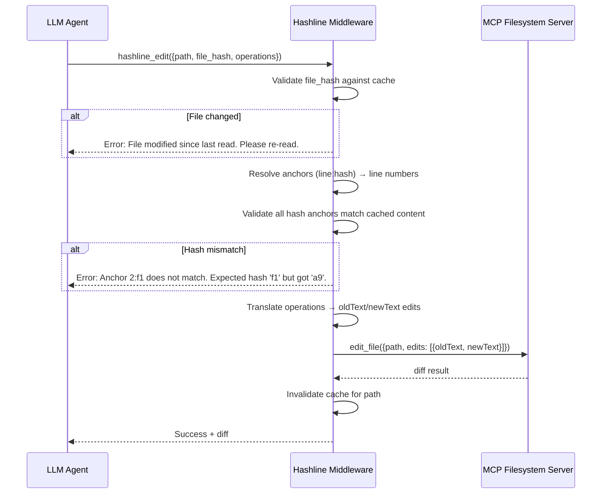

# Hashline: Content-Hash Anchored File Editing for LLM Agents

## Problem Statement

LLM agents editing files face a fundamental reliability problem: **edits silently corrupt files when the file has changed since the agent last read it**. The standard MCP `edit_file` tool uses `oldText`/`newText` substring matching — if the file changed between read and edit, the match may succeed on wrong content, or fail with a cryptic error.

Additionally, current edit tools require the model to **reproduce exact original content** (including whitespace) to anchor its changes. This is expensive, error-prone, and wastes context window tokens.

## The Hashline Concept

**Core idea**: Tag every line in file reads with a short content hash. The model uses these hashes as anchors when editing, instead of reproducing original text.

From: https://blog.can.ac/2026/02/12/the-harness-problem/

### Read Output Format

When reading a file, each line gets a 2-character hex hash suffix derived from its content:

```
1:a3|function hello() {
2:f1|  return "world";
3:0e|}
```

Format: `{lineNumber}:{hash}|{content}`

- **Line number** — 1-indexed
- **Hash** — 2-char hex derived from line content (e.g., first byte of CRC32 or FNV-1a)
- **Pipe separator** — cleanly delineates metadata from content

### Edit Operations via Hashes

Instead of `oldText`/`newText`, the model specifies edits using hash-anchored operations:

| Operation       | Description                  | Example                                       |
| --------------- | ---------------------------- | --------------------------------------------- |
| `replace`       | Replace specific line(s)     | `replace 2:f1 with '  return "hello";'`       |
| `replace_range` | Replace a range of lines     | `replace 1:a3..3:0e with <new content>`       |
| `insert_after`  | Insert line(s) after anchor  | `insert_after 2:f1 '  console.log("debug");'` |
| `insert_before` | Insert line(s) before anchor | `insert_before 1:a3 '// greeting function'`   |
| `delete`        | Remove line(s)               | `delete 2:f1`                                 |
| `delete_range`  | Remove a range               | `delete 1:a3..3:0e`                           |

### Safety Guarantees

1. **Staleness detection** — If the file changed since the read, line hashes won't match → edit rejected
2. **Anchor confidence** — If the model can recall `2:f1`, it (probabilistically) knows what it's editing
3. **No content reproduction** — The model never needs to reproduce `oldText`, saving tokens and eliminating whitespace bugs

## Architecture: Transparent MCP Middleware

The key insight is that Hashline can be implemented as a **transparent middleware layer** in the Citadel `CoreAgent`, wrapping the existing MCP filesystem tools. No changes to the underlying MCP server are needed.


### Interception Points

The Citadel already has middleware patterns in [`CoreAgent.registerBuiltinTools()`](the-citadel/src/core/agent.ts#L70-L122):

- **Input middleware** — Injects `.gitignore` patterns into `search_files` / `directory_tree`
- **Output middleware** — Filters forbidden entries from `list_directory` results

Hashline extends this pattern:

1. **Read interception (output)**: After `read_text_file` returns, inject hashline tags into each line
2. **Edit interception (input)**: Before `edit_file` is called, translate hashline operations → `oldText`/`newText` edits
3. **Hash cache**: Maintain a per-file hash map (`Map<path, Map<lineNum, {hash, content}>>`) in memory

### Tool Surface

We present **additional** hashline-enhanced tools alongside the originals. The agent gets both:

| Original Tool               | Hashline Tool              | Notes                                       |
| --------------------------- | -------------------------- | ------------------------------------------- |
| `filesystem_read_text_file` | `filesystem_hashline_read` | Returns hashline-tagged content             |
| `filesystem_edit_file`      | `filesystem_hashline_edit` | Accepts hash-anchored operations            |
| `filesystem_write_file`     | *(no hashline variant)*    | Full overwrite doesn't benefit from hashing |

> [!IMPORTANT]
> Both tool sets coexist. The model can choose plain or hashline tools based on the task. Instructions can recommend hashline for complex multi-step edits and plain tools for simple overwrites.
The user can also define what tools the agent has access to using the mcpTools configuration in citadel.config.js.


## Detailed Design

### 1. Hash Function

Requirements:
- **Deterministic** — Same content → same hash
- **Fast** — Computed per-line on every read
- **Short** — 2 hex chars (256 possible values) is sufficient for disambiguation
- **Collision-resistant enough** — Within a single file, 256 values for typically <1000 lines gives acceptable collision probability (~86% unique for 100 lines via birthday paradox). Lines with collisions are still disambiguated by line number.

**Proposed**: FNV-1a hash of line content (trimmed of trailing whitespace), output as first byte (2 hex chars):

```typescript
function hashLine(content: string): string {
  // FNV-1a hash, take lowest byte
  let hash = 0x811c9dc5; // FNV offset basis
  const trimmed = content.trimEnd();
  for (let i = 0; i < trimmed.length; i++) {
    hash ^= trimmed.charCodeAt(i);
    hash = (hash * 0x01000193) | 0; // FNV prime
  }
  return (hash & 0xff).toString(16).padStart(2, '0');
}
```

Trimming trailing whitespace before hashing ensures the hash is insensitive to trailing space differences, which are a common source of spurious edit failures.

### 2. Hash Cache (`HashlineCache`)

```typescript
interface HashlineEntry {
  hash: string;        // 2-char hex
  content: string;     // original line content
}

interface HashlineFileState {
  entries: Map<number, HashlineEntry>;  // lineNum → entry
  readTimestamp: number;                // for staleness warnings
  fullContentHash: string;             // SHA-256 of entire file for change detection
}

class HashlineCache {
  private cache: Map<string, HashlineFileState> = new Map();  // path → state
  
  // Populate cache on read
  cacheFile(path: string, content: string): string;     // returns hashline-tagged output
  
  // Validate hashes on edit
  validateAnchors(path: string, anchors: Anchor[]): ValidationResult;
  
  // Invalidate on write/edit
  invalidate(path: string): void;
}
```

### 3. Hashline Read Tool Schema

```typescript
// Input: same as read_text_file
{
  path: string;
  head?: number;   // first N lines
  tail?: number;   // last N lines
}

// Output: hashline-tagged content
// Example:
// 1:a3|function hello() {
// 2:f1|  return "world";
// 3:0e|}
// 
// ---
// hashline_version: 1
// total_lines: 3
// file_hash: abc123...  (truncated SHA-256)
```

The metadata footer provides the model with total line count and a file-level hash for later validation.

### 4. Hashline Edit Tool Schema

```typescript
{
  path: string;
  file_hash: string;    // file-level hash from read, for staleness check
  operations: Array<{
    type: 'replace' | 'insert_after' | 'insert_before' | 'delete';
    anchor: string;      // e.g. "2:f1"
    end_anchor?: string; // for range operations, e.g. "5:b2"
    content?: string;    // new content (for replace/insert), can be multi-line
  }>;
  dry_run?: boolean;     // preview diff without applying
}
```

### 5. Edit Translation Pipeline

When the model calls `filesystem_hashline_edit`:



### 6. Anchor Resolution Algorithm

```
resolve_anchor("2:f1"):
  1. Look up line 2 in cache
  2. If cache[2].hash === "f1" → return line 2 content ✓
  3. If cache[2].hash !== "f1":
     a. Search all lines for hash "f1"
     b. If exactly 1 match found → return that line (moved line)
     c. If 0 or >1 matches → ERROR: ambiguous anchor
```

This provides resilience against minor line shifts (e.g., a preceding blank line was added).

### 7. Integration with Existing Citadel Middleware

The hashline module lives in `src/core/hashline.ts` and integrates with the tool registration pipeline:

```
CoreAgent.registerBuiltinTools()
  ├── For each MCP tool:
  │   ├── Existing: .gitignore injection middleware
  │   ├── Existing: permission checks
  │   └── NEW: Hashline tool registration (additional tools)
  └── NEW: Register hashline_read and hashline_edit as additional tools
```

The hashline tools don't replace the originals — they're separate tools registered alongside them. This means:

- `filesystem_read_text_file` — works as today (plain content)
- `filesystem_hashline_read` — returns hashline-tagged content
- `filesystem_edit_file` — works as today (oldText/newText)
- `filesystem_hashline_edit` — accepts hash-anchored operations

## Implementation Plan

### Phase 1: Core Hashline Engine (`src/core/hashline.ts`)

#### [NEW] [hashline.ts](the-citadel/src/core/hashline.ts)

- `hashLine(content: string): string` — FNV-1a hash function
- `HashlineCache` class — caching file states with hash maps
- `tagContent(path: string, rawContent: string): string` — convert raw file content to hashline-tagged output
- `resolveAnchors(path: string, anchors: Anchor[]): ResolvedLine[]` — resolve hash anchors to line content
- `translateToEdits(operations: HashlineOp[]): {oldText, newText}[]` — convert hashline operations to MCP edit format

### Phase 2: Tool Registration (`src/core/agent.ts`)

#### [MODIFY] [agent.ts](the-citadel/src/core/agent.ts)

In `registerBuiltinTools()`, after MCP tools are loaded:

1. Check if `filesystem_read_text_file` and `filesystem_edit_file` exist in registered tools
2. Register `filesystem_hashline_read` — wraps read, post-processes output through `tagContent()`
3. Register `filesystem_hashline_edit` — validates anchors, translates to `edit_file` call

### Phase 3: Agent Instructions

#### [MODIFY] [instructions](the-citadel/.citadel/instructions)

Add guidance to agent instructions explaining when to use hashline tools vs. plain tools:
- Use hashline for multi-step editing workflows (read → plan → edit → verify)
- Use plain tools for simple create/overwrite scenarios
- Always re-read after an edit to refresh the hash cache

### Phase 4: Testing

#### [NEW] [hashline.test.ts](the-citadel/tests/unit/hashline.test.ts)

Unit tests for the core hashline engine:
- Hash function determinism and distribution
- Cache population and invalidation
- Anchor resolution (exact match, moved line, ambiguous)
- Operation translation (replace, insert, delete, ranges)
- Staleness detection (file_hash mismatch)
- Edge cases: empty files, single-line files, very long lines, unicode content

#### [NEW] [hashline_integration.test.ts](the-citadel/tests/integration/hashline_integration.test.ts)

Integration tests with actual filesystem:
- Read → edit → verify cycle
- Concurrent modification detection
- Multi-edit operations
- Preserve file formatting

## Verification Plan

### Automated Tests

```bash
# Unit tests
bun test tests/unit/hashline.test.ts

# Integration tests  
bun test tests/integration/hashline_integration.test.ts

# All tests (ensure no regressions)
bun test
```

### Manual Verification

After implementation, the hashline tools should be exercised through a live agent run to verify:
1. Agent reads a file with `filesystem_hashline_read` and sees tagged output
2. Agent makes an edit with `filesystem_hashline_edit` and the edit applies correctly
3. A stale edit (file modified externally) is properly rejected
4. The diff output makes sense

## Open Questions

1. **Cache lifetime** — Should the hash cache persist across agent runs, or be ephemeral per-run? (Recommended: ephemeral per-run, simplifies invalidation)

2. **Hash length** — 2 hex chars gives 256 values. Should we use 3 (4096 values) for larger files? Trade-off: more tokens vs. fewer collisions.

3. **Line number stability** — When a line moves (e.g., insert above), the hash stays the same but the line number changes. The fuzzy anchor resolution handles this, but should we also warn if anchors resolve to different line numbers than specified?

4. **Binary files** — Hashline is text-only. Should `hashline_read` reject binary files explicitly, or fall back to `read_text_file` behavior?

5. **Tool naming** — `filesystem_hashline_read` vs. `filesystem_read_hashline` vs. `hl_read`. The naming should be clear but not too long. Consider that the LLM will need to recall and type these names.

## Appendix: Token Savings Analysis

For a typical `edit_file` call that changes 1 line in a 50-line file:

| Approach            | Tokens (est.) | Notes                                          |
| ------------------- | ------------- | ---------------------------------------------- |
| `oldText`/`newText` | ~150-300      | Must reproduce exact old content + new content |
| `hashline_edit`     | ~30-50        | Just anchor `"42:f1"` + new content            |
| **Savings**         | **~70-80%**   | Per edit operation                             |

For multi-edit workflows (read + 3 edits), savings compound significantly. The hashline-tagged read adds ~10% overhead to read output, but this is amortized across multiple edit operations.
